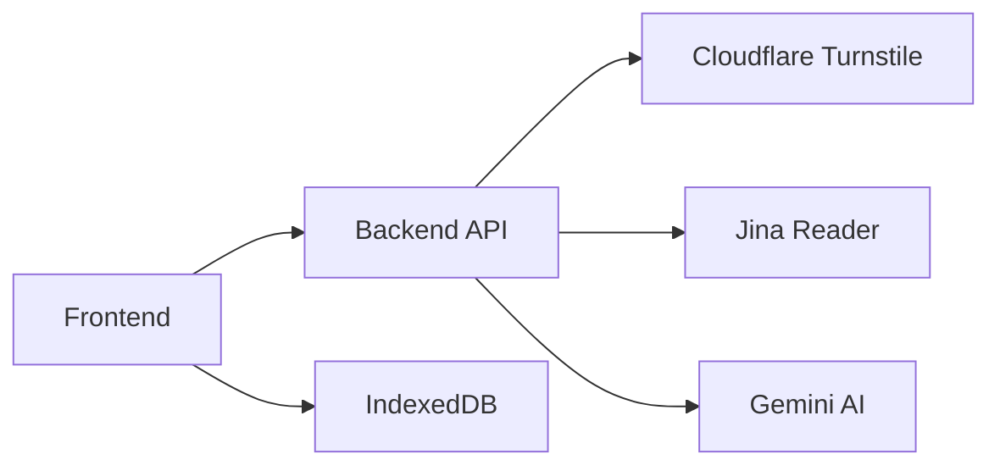

# TL;DR-ify 📝✨

A lightweight AI-powered summarization tool that transforms long-form content into concise, digestible recaps. Perfect for students, researchers, and professionals who need quick insights from documents, articles, or text.

🔗 **Live Demo**: [tldrify.dvy9.dev](https://tldrify.dvy9.dev)

## ✨ Features

### Input Flexibility

- **Text**: Paste any free-form text directly
- **URLs**: Summarize web content with intelligent link ingestion
- **Documents**: Support for PDF, Office docs, CSV, PPT, EPUB, images, and more

### Customizable Output

- **Writing Style**: Choose from concise, formal, technical, creative, or scientific tones
- **Length Control**: Adjust summary length from 100-500 words
- **AI Models**: Select between Gemini 2.5 Flash, Gemini 2.0 Flash, or GPT-5 Nano

### Technical Excellence

- **Offline Access**: Client-side storage via IndexedDB for previous summaries
- **Security**: Cloudflare Turnstile protection against abuse
- **Reliable Processing**: Jina Reader integration for robust URL content extraction
- **File Handling**: 5 MiB upload limit with server-side validation

## 🏗️ Architecture



**Technical Stack**:

- **Frontend**: Vite + React (TypeScript), Tailwind v4 via Origin UI
- **Backend**: FastAPI with Python 3.12+
- **Storage**: IndexedDB for client-side data persistence
- **Processing**: markitdown for document conversion, Gemini API for summarization

## 🚀 Quick Start

### Prerequisites

- Node.js 20+ & `pnpm` (`corepack enable`)
- Python 3.12+
- [`uv`](https://docs.astral.sh/uv/getting-started/installation/)
- API keys for [Gemini](https://ai.google.dev/gemini-api/docs/api-key), [Jina](https://jina.ai/), and [Cloudflare Turnstile](https://developers.cloudflare.com/turnstile/get-started/)

### Installation

1. **Clone and setup frontend**:

   ```bash
   cd frontend
   cp .env.example .env  # Add your VITE_TURNSTILE_SITE_KEY
   pnpm install
   pnpm dev
   ```

2. **Setup backend**:

   ```bash
   cd backend
   cp .env.example .env  # Add GEMINI_API_KEY, JINA_API_KEY, TURNSTILE_SECRET_KEY
   uv sync
   uv run --env-file=.env uvicorn main:app --reload
   ```

3. **Access applications**:
   - Frontend: <http://localhost:5173>
   - Backend API: <http://localhost:8000>
   - API Documentation: <http://localhost:8000/docs>

## ⚙️ Configuration

### Environment Variables

**Frontend (.env)**:

```env
VITE_TURNSTILE_SITE_KEY=your_public_site_key
```

**Backend (.env)**:

```env
GEMINI_API_KEY=your_gemini_key
JINA_API_KEY=your_jina_reader_key
TURNSTILE_SECRET_KEY=your_turnstile_secret
```

## 📚 API Reference

### POST `/api/summarize`

Summarizes content from text, URLs, or uploaded files.

**Form Data**:

| Field            | Type   | Required    | Description                                                                 |
| ---------------- | ------ | ----------- | --------------------------------------------------------------------------- |
| `message`        | string | Conditional | Text content or URL to summarize                                            |
| `settings`       | JSON   | Yes         | `{"model": "gemini-2.5-flash", "writingStyle": "concise", "maxWords": 200}` |
| `turnstileToken` | string | Yes         | Cloudflare Turnstile verification token                                     |
| `file`           | file   | Optional    | Document file (≤ 5 MiB)                                                     |

**Example Request**:

```bash
curl -X POST http://localhost:8000/api/summarize \
  -F "message=https://example.com/article" \
  -F 'settings={"model":"gemini-2.5-flash","writingStyle":"concise","maxWords":200}' \
  -F "turnstileToken=your_verification_token"
```

**Success Response**:

```json
{
  "title": "Summary Title",
  "answer": "Concise summary content..."
}
```

**Error Responses**:

- `400` - Validation error
- `403` - Turnstile verification failed
- `413` - File too large
- `422` - Processing error

## 🛠️ Development

### Frontend Commands

```bash
pnpm dev      # Development server
pnpm build    # Production build
pnpm preview  # Preview production build
pnpm lint     # Run linting
```

### Backend Commands

```bash
uv run --env-file=.env uvicorn main:app --reload  # Development server
```

### Project Structure

```txt
frontend/
  dist/           # Build artifacts (safe to delete)
  src/            # React application source
backend/
  main.py         # FastAPI application and route handlers
```

## 📄 License

Proprietary - contact the author for reuse permissions.

## 🆘 Troubleshooting

1. **Missing environment variables** will cause `500` errors - ensure all keys are set
2. **Large files** (>5 MiB) will be rejected with `413` status
3. **Invalid Turnstile tokens** return `403` errors
4. **Build issues** - delete `frontend/dist/` and rebuild

For additional support, check the API documentation at `/docs` when running locally.
